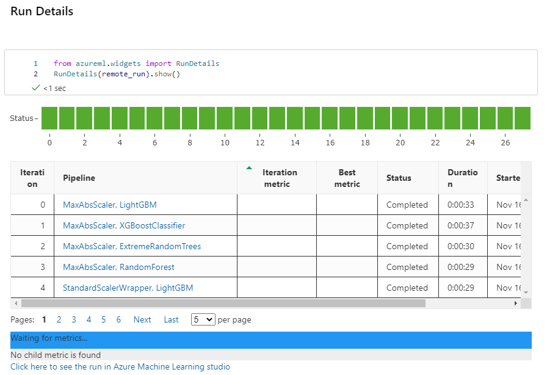
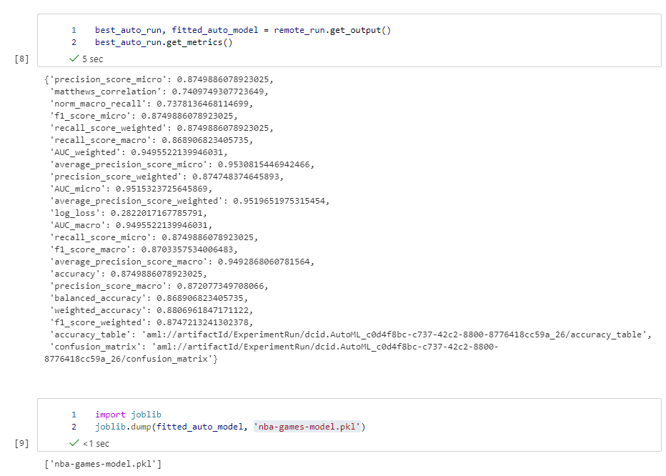
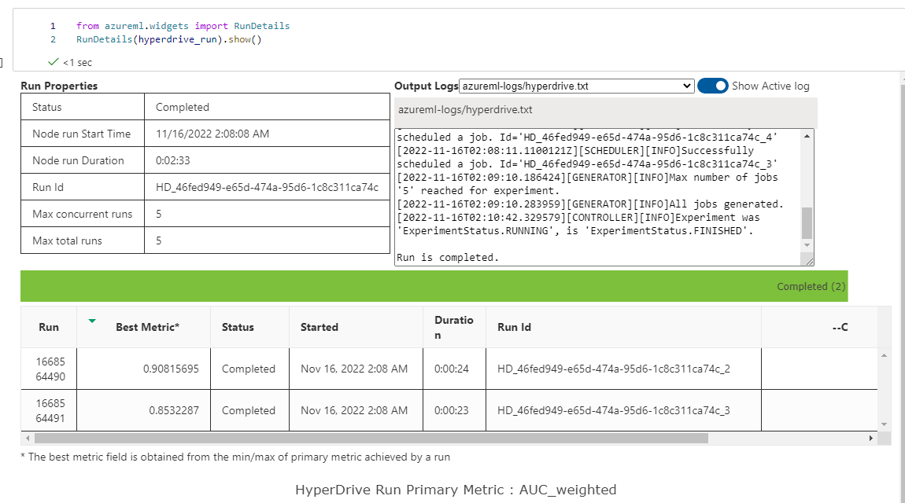
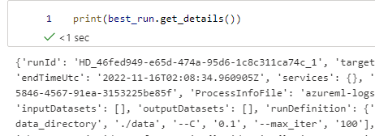
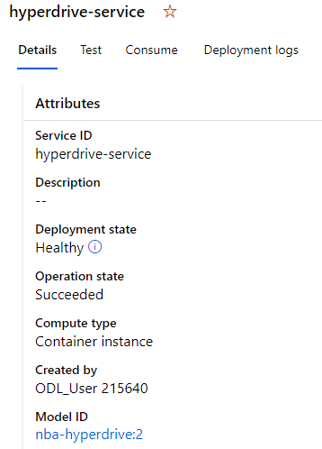

# NBA Games Prediction

The National Basketball Association (NBA) is one of the most exciting professional sports organizations in America.  Major League Baseball has demonstrated the benefit of data and analytics to help make personell and strategy decisions to create positive outcomes, notably demonstrated in the movie Moneyball.  The NBA has much room to grow in terms of using an empirical approach to decision making.  This model will attempt to highlight the major characteristics that are present in a win.  With a predictive model for a team's success, coaches can run through different scenarios on how they want to gameplan against a specific team.

## Dataset

### Overview
The NBA Games Data Kaggle dataset (https://www.kaggle.com/datasets/nathanlauga/nba-games) is a dataset of all NBA games from 2004-2020.  The information was collected from the NBA stats website and contains key information about the perfromance of each team during the game.  I will be using this data to train a model on what the key characteristics are for an NBA team in a win.  Using a data-driven approach, NBA teams can choose their focus area for strategizing and practicing when preparing for a successful season.

### Task
The model will be a classification effort to predict if the home team will win the game.  Classifying a home win will help incorporate any advantage that occurs in a team's home stadium.  The features that will be used in the model are the raw values for:
- PTS_home: The number of points the home team scored
- FG_PCT_home: The field goal percentage for the home team
- FT_PCT_home: The free throw percentage for the home team
- FG3_PCT_home: The 3 point field goal percentage for the home team
- AST_home: The number of assists for the home team
- REB_home: The number of rebounds for the home team
- FG_PCT_away: The field goal percentage for the home team 
- FT_PCT_away: The free throw percentage for the home team
- FG3_PCT_away: The 3 point field goal percentage for the home team
- AST_away: The number of assists for the home team
- REB_away: The number of rebounds for the home team

There could additionally be another model that includes the home team and away team ID to identify which teams have a larger home advantage as well as identify teams/schemes that the home team struggles with.  For the purpose of this exercise, normalizing this approach over time is out of scope.  The model solely deals with data that occurred during the game.  An iteresting feature to highlight is PTS_home.  Knowing how many points will most likely result in a win will be an interesting feature to frame in-game strategies.

### Access
The dataset was downloaded from Kaggle and manually updated into Azure via the Datasets UI.

## Automated ML
The autoML settings were 3 cross validations, using weighted AUC as the primary metric, and it enabled early stopping while also having a timeout of 0.25 hours.  Again, this was for a classification model predicting the home team would win.

### Results
The model selected was a Voting Classifier and it finished with an AUC of 0.95.  The voting models use many different estimators, such as a lightGBM classifier, and each one has its own set of hyperparameters.  What the model AUC tells me is that the data used to make the prediction was too highly correlated with the outcome.  Clearly a team that shoots better will score more and has a higher chance to win.  I was hoping that we would be able to see more interaction between key features that lead to a win.  Additionally, more data columns could be used in the future to have a better model, even if that might mean a lower AUC.

## Hyperparameter Tuning
After the automl run I was hoping that simpler feature interaction could provide more explainability of the features, so I chose a simple logistic regression for classification.  I adjusted the inverse of regulation strength and max iterations the model would run.  I selected a basic set of ranges using a RandomParameterSampling method. For the inverse regulation strength that was [0.01, 0.1, 1] and max iterations was [10, 20, 50, 100, 250].

### Results
The best model had an AUC of 0.92 with an inverse regulation strength coefficient of 0.1 and the number of maximum iterations set to 100.  Again, this AUC is clearly still too high based on the dataset.  Improvements to the data will lead to an improved model.

## Model Deployment
The hyperdrive final model was the model I chose to deploy and query for testing.  From the feature set listed above, providing a float value for the data and passing the data along in JSON format will hit the endpoint and return a model value.  This value will give the prediction for whether the home team is projected to win.

## Screen Recording
Working model demo is found here:
https://vimeo.com/771434918
